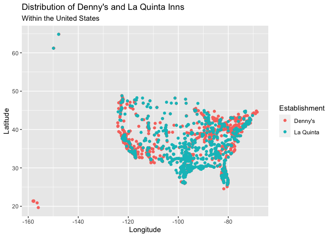
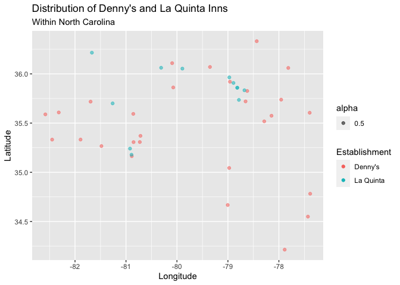
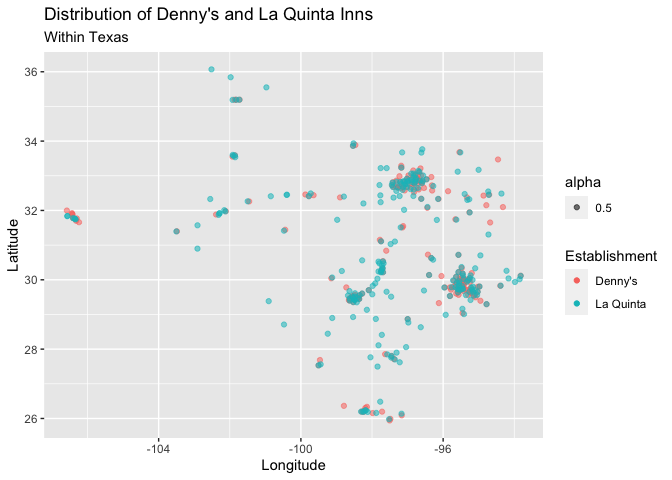

Lab 04 - La Quinta is Spanish for next to Denny’s, Pt. 1
================
Kyle Knaut
January 19th, 2024

### Load packages and data

``` r
library(tidyverse) 
library(dsbox) 
```

``` r
states <- read_csv("data/states.csv")
```

### Exercise 1

``` r
#The Denny's dataset has 1643 observations (AKA 1643 Denny's)
print(nrow(dennys))
```

    ## [1] 1643

``` r
#There are 6 variables in this dataset
print(ncol(dennys))
```

    ## [1] 6

``` r
#The variables in this dataset are shown below
names(dennys)
```

    ## [1] "address"   "city"      "state"     "zip"       "longitude" "latitude"

### Exercise 2

``` r
#The La Quinta dataset has 909 observations (AKA 909 La Quintas)
print(nrow(laquinta))
```

    ## [1] 909

``` r
#There are 6 variables in this dataset
print(ncol(laquinta))
```

    ## [1] 6

``` r
#The variables in this dataset are shown below
names(laquinta)
```

    ## [1] "address"   "city"      "state"     "zip"       "longitude" "latitude"

### Exercise 3

There are no Dennys locations outside of the US according to their
website. There are, however, many La Quintas outside of the United
States, with locations in Canada, Mexico, China, New Zealand, Turkey,
The United Arab Emirates, Chile, Colombia, and Ecuador

### Exercise 4

In order to determine where locations outside of the us are within the
data, I would use the filter function. I initially thought would filter
the dataset for values where country != “US”, however, after looking,
there is no country variable for these datasets. Instead, I will look
into the data and see how locations outside of the US code their
zipcodes, or states. If either of these show up as NA for countries
other than the US, then I will filter out these null values, hopefully
resulting in an analysis of domestic locations.

Okay, so after trolling through the data trying to find a La Quinta in
another country, I have realized that this may be more difficult than I
had initially thought. I have found two La Quintas in Puebla, Mexico,
but both of them have a value for state (PU), and a zipcode. The only
other ways I could think of to do this are by filtering for the 51
states in the US and dropping all other values, something with longitude
and lattitude (but this is complicated with Alaska and Hawaii), or by
using the states dataset somehow, maybe using that set to filter for the
51 states.

### Exercise 5

It’s the function I was dreaming of! Still no Dennys outside the US but
cool the function exists :)

``` r
dennys %>%
  filter(!(state %in% states$abbreviation))
```

    ## # A tibble: 0 × 6
    ## # ℹ 6 variables: address <chr>, city <chr>, state <chr>, zip <chr>,
    ## #   longitude <dbl>, latitude <dbl>

### Exercise 6

``` r
dennys %>%
  mutate(country = "US")
```

    ## # A tibble: 1,643 × 7
    ##    address                        city    state zip   longitude latitude country
    ##    <chr>                          <chr>   <chr> <chr>     <dbl>    <dbl> <chr>  
    ##  1 2900 Denali                    Anchor… AK    99503    -150.      61.2 US     
    ##  2 3850 Debarr Road               Anchor… AK    99508    -150.      61.2 US     
    ##  3 1929 Airport Way               Fairba… AK    99701    -148.      64.8 US     
    ##  4 230 Connector Dr               Auburn  AL    36849     -85.5     32.6 US     
    ##  5 224 Daniel Payne Drive N       Birmin… AL    35207     -86.8     33.6 US     
    ##  6 900 16th St S, Commons on Gree Birmin… AL    35294     -86.8     33.5 US     
    ##  7 5931 Alabama Highway, #157     Cullman AL    35056     -86.9     34.2 US     
    ##  8 2190 Ross Clark Circle         Dothan  AL    36301     -85.4     31.2 US     
    ##  9 900 Tyson Rd                   Hope H… AL    36043     -86.4     32.2 US     
    ## 10 4874 University Drive          Huntsv… AL    35816     -86.7     34.7 US     
    ## # ℹ 1,633 more rows

### Exercise 7

``` r
#Canada (ON, BC)
#Colombia (ANT)
#Mexico (AG, CH, PU, VE, SL)
#No Observation for Quito, Ecuador
#No Observation for Santiago, Chile
#No Observation for Dubai, UAE
#No Observations for Bodrum, Giresun, or Istanbul, Turkey
#No Observations for Auckland or Queenstown, New Zealand
#No Observations for Weifang or Taiyuan, China
```

### Exercise 8

``` r
laquinta %>%
  mutate(country = case_when(state %in% state.abb ~ "United States", state %in% c("ON", "BC") ~ "Canada", state == "ANT" ~ "Colombia", state %in% c("AG", "CH", "PU", "VE", "SL") ~ "Mexico"))
```

    ## # A tibble: 909 × 7
    ##    address                          city  state zip   longitude latitude country
    ##    <chr>                            <chr> <chr> <chr>     <dbl>    <dbl> <chr>  
    ##  1 793 W. Bel Air Avenue            "\nA… MD    21001     -76.2     39.5 United…
    ##  2 3018 CatClaw Dr                  "\nA… TX    79606     -99.8     32.4 United…
    ##  3 3501 West Lake Rd                "\nA… TX    79601     -99.7     32.5 United…
    ##  4 184 North Point Way              "\nA… GA    30102     -84.7     34.1 United…
    ##  5 2828 East Arlington Street       "\nA… OK    74820     -96.6     34.8 United…
    ##  6 14925 Landmark Blvd              "\nA… TX    75254     -96.8     33.0 United…
    ##  7 Carretera Panamericana Sur KM 12 "\nA… AG    20345    -102.      21.8 Mexico 
    ##  8 909 East Frontage Rd             "\nA… TX    78516     -98.1     26.2 United…
    ##  9 2116 Yale Blvd Southeast         "\nA… NM    87106    -107.      35.1 United…
    ## 10 7439 Pan American Fwy Northeast  "\nA… NM    87109    -107.      35.2 United…
    ## # ℹ 899 more rows

``` r
#I feel like we could use != to do this with less headache but still 
#glad for the experience

#laquinta <- laquinta %>%
  #filter(country == "United States")
#Did not recognize country as an object despite the fact that it showed
#up perfectly in my table

#exists(country)
laquinta <- laquinta %>%
  filter(state %in% states$abbreviation)
```

### Exercise 9

``` r
laquinta %>%
  count(state, sort = TRUE)
```

    ## # A tibble: 48 × 2
    ##    state     n
    ##    <chr> <int>
    ##  1 TX      237
    ##  2 FL       74
    ##  3 CA       56
    ##  4 GA       41
    ##  5 TN       30
    ##  6 OK       29
    ##  7 LA       28
    ##  8 CO       27
    ##  9 NM       19
    ## 10 NY       19
    ## # ℹ 38 more rows

``` r
dennys %>%
  count(state, sort = TRUE)
```

    ## # A tibble: 51 × 2
    ##    state     n
    ##    <chr> <int>
    ##  1 CA      403
    ##  2 TX      200
    ##  3 FL      140
    ##  4 AZ       83
    ##  5 IL       56
    ##  6 NY       56
    ##  7 WA       49
    ##  8 OH       44
    ##  9 MO       42
    ## 10 PA       40
    ## # ℹ 41 more rows

Dennys: California has the most Denny’s by far, with 203 more than the
next closest state, which is Texas (who have 200 Denny’s). Delaware has
the least Denny’s of any state with only one Dennys. Poor Delaware,
Grand Slams are rare there :((

La Quinta: Texas comes in at number one here, with 237 La Quinta Inns.
This is far more than any other state, as the next highest state is
Florida with 74. Maine has the fewest La Quinta Inns, with only one :(

All in all, the results of this cursory glance make a lot of sense, but
they do, unfortunately, violate Mitch Hedburg’s premise that La Quinta
roughly translates to next to the Dennys, especially in California,
where there are nearly 8 times as many Denny’s as there are La Quinta
Inns.

### Exercise 10

``` r
dennys <- dennys %>%
  mutate(establishment = "Denny's")

laquinta <- laquinta %>%
  mutate(establishment = "La Quinta")

dennys_laquinta <- bind_rows(dennys, laquinta)

ggplot(dennys_laquinta, mapping = aes(x = longitude, y = latitude, color = establishment)) + geom_point() + labs(x = "Longitude", y = "Latitude", color = "Establishment", title = "Distribution of Denny's and La Quinta Inns", subtitle = "Within the United States")
```

<!-- -->

### Exercise 11

``` r
dennys_laquinta %>%
  filter(state == "NC") %>%
  ggplot(dennys_laquinta, mapping = aes(x = longitude, y = latitude, color = establishment, alpha = 0.5)) + geom_point() + labs(x = "Longitude", y = "Latitude", color = "Establishment", title = "Distribution of Denny's and La Quinta Inns", subtitle = "Within North Carolina")
```

<!-- -->

### Exercise 12

``` r
dennys_laquinta %>%
  filter(state == "TX") %>%
  ggplot(dennys_laquinta, mapping = aes(x = longitude, y = latitude, color = establishment, alpha = 0.5)) + geom_point() + labs(x = "Longitude", y = "Latitude", color = "Establishment", title = "Distribution of Denny's and La Quinta Inns", subtitle = "Within Texas")
```

<!-- -->
Mitch Hedberg’s joke appears to hold a lot better here, but it’s hard to
say for certain without getting into the nitty gritty stats.
